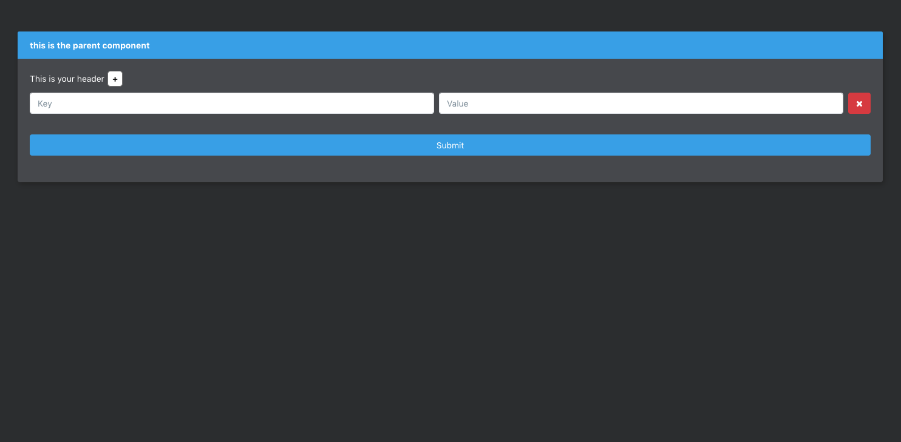
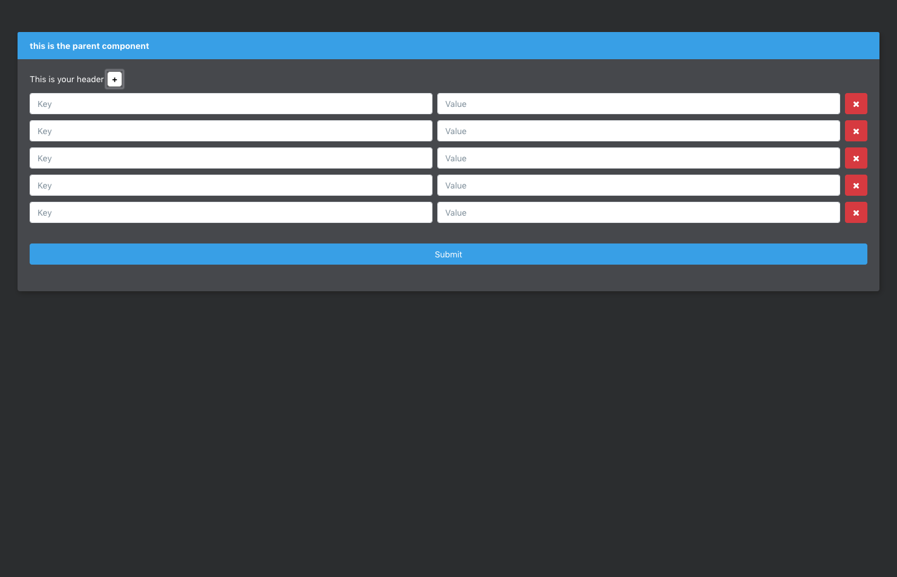
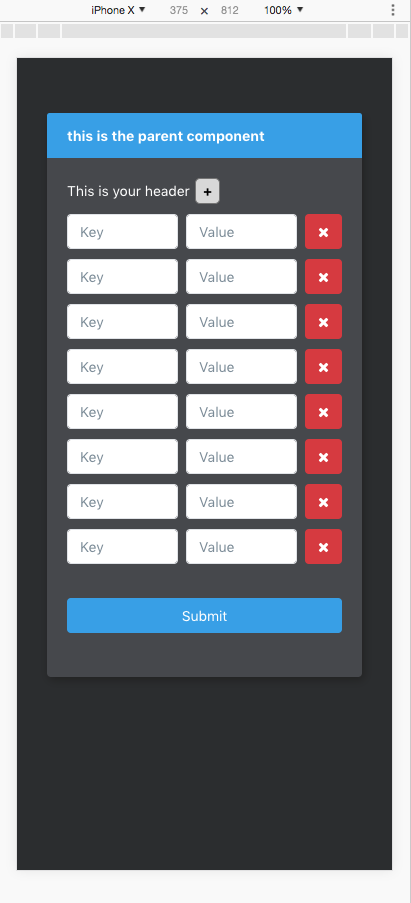

## DragonChain - 'KeyVal'

### Task at Hand
1. Recreate the attached image(s) with appropriate semantic HTML5, SCSS, and React.
2. Replace the placeholder component with a parent component capable of maintaining state.
3. This component will have:
    * One `KeyValue` component within it to begin.
    * A header with the name of the component, a button with a `+` symbol to add another `KeyValue` component (as many as the user wishes within reason), and a submit button.
4. The `KeyValue` component should have two text inputs `${key} ${value}` and a button to remove it from the dom.
5. On submit (which lives in the parent), all the values from each key value in the dom should be structured into json and logged to the browser console.

## Example
If there are two key value inputs, on submit, it would create this object and show in the console like so:

```javascript
`${keyOfFirstInput}`: `${valueOfFirstInput}`,
`${keyOfSecondInput}`: `${valueOfSecondInput}`
```

## Images

#### Full screen view

#### Full screen view with more forms inputs

#### Mobile view

